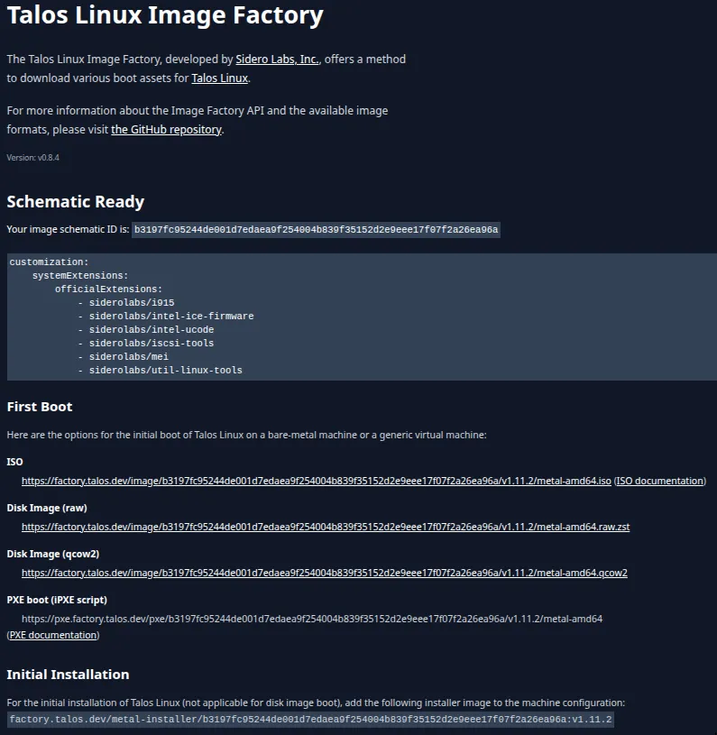
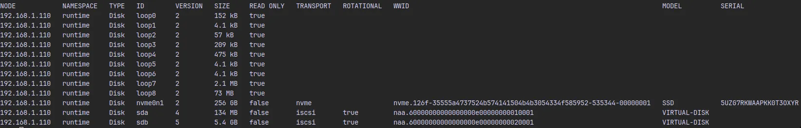
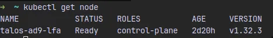

## Prerequisites

Before setting up Talos Linux, make sure you have the following:
- **Compatible hardware**:  An old physical server, desktop, or any spare machine where you can install Talos Linux.  (Alternatively, you can use a VM, but bare metal is often preferred for homelabs.)
- **Bootable USB drive**:  An extra USB stick to create a Talos Linux boot medium. This will be used to install or boot into Talos on your target machine.
- **Access to your home network**:  You’ll need access to your router or DHCP server in order to assign a **static IP address** to the machine running Talos.
- **Basic networking knowledge**:  Comfort with concepts like IP addressing and DHCP reservations will make the setup easier.

---

## Setup Bootable USB Drive

We’ll use [Ventoy](https://www.ventoy.net) to prepare a bootable USB drive. Ventoy is a powerful tool that allows you to copy multiple ISO images to a single USB stick and boot from them without reformatting.

### Install Ventoy

1. Download Ventoy from the [official release page](https://www.ventoy.net/en/download.html).
2. Plug in your USB drive (make sure to back up any important data — the setup will erase it).
Once installed, your USB drive will be Ventoy-enabled.

### Advantages of Ventoy

- **Multi-boot support**: Store and boot multiple ISOs on a single USB stick.  
- **Easy updates**: Just copy or delete ISO files, no need to recreate the boot media.

---

## Install Suitable talos linux 
Talos Linux provides an **Image Factory**, an online tool that lets you build custom Talos images with specific system extensions included.

### Steps

1. Go to the [Talos Linux Image Factory](https://factory.talos.dev/).  
2. Select the base Talos Linux version you want to install.  
3. Add the following system extensions to ensure compatibility with your setup:  
- Intel Based Systems
   - `siderolabs/i915`
   - `siderolabs/intel-ice-firmware`
   - `siderolabs/intel-ucode`
   - `siderolabs/mei`
- Longhorn Requirements
  - `siderolabs/util-linux-tools`
  - `siderolabs/iscsi-tools`
4. Generate and download the image (ISO or disk image, depending on your target hardware).  
5. Copy the image to your Ventoy-enabled USB drive.

  

---

## Booting Into Talos Linux

When you boot the target machine with the Talos image:

- The system will start up and drop into **maintenance mode**.  
- **Maintenance mode** is a temporary state that allows interactive access to the node for diagnostics and initial configuration.  
- In this mode you can interact with Talos using `talosctl` in an *insecure* way (without needing an authenticated `talosconfig`). This is only meant for setup or troubleshooting.  

⚠️ **Important**: Once the system completes setup, Talos will no longer allow insecure access. From that point on, you must use a valid, authenticated `talosconfig` file for all API interactions.  

### Steps:

#### 1. List available disks on the control plane node
```bash
export CONTROL_PLANE_IP="<Static IP of Node>"
talosctl get disks --insecure --nodes $CONTROL_PLANE_IP
```

This shows all disks. Identify the disk where Talos will be installed (e.g., nvme0n1).
  

#### 2. Generate the Talos configuration file
- After Getting `ID` of disk, pass it to `DISK_NAME`
```bash
export CLUSTER_NAME="<Cluster Name (anything)>"
export DISK_NAME=nvme0n1
talosctl gen config $CLUSTER_NAME https://$CONTROL_PLANE_IP:6443 \
    --install-disk /dev/$DISK_NAME
```

- What Each Generated File Does ?
  - `talosconfig` -> The client configuration file that allows `talosctl` to securely authenticate and manage Talos nodes
  - `controlplane.yaml` -> The machine configuration for your control plane node(s). Defines networking, disks, extensions, and cluster roles
  - `worker.yaml` -> The machine configuration for worker nodes that will join the cluster and run workloads.

#### 3. Update `controlplane.yaml` for a Single-Node Cluster

When running a single-node Talos cluster, you need to update the generated `controlplane.yaml` to reflect that this node will host both control plane and workload components.

Open the generated `controlplane.yaml` file.  
- Enable `allowSchedulingOnControlPlanes` for allowing scheduling pods on control plane.
  ```yaml
  cluster:
    allowSchedulingOnControlPlanes: true
  ```
- Remove `node.kubernetes.io/exclude-from-external-load-balancers` label for allowing external loadbalancer to send traffic to controlplane node.
  ```yaml
  ## Remove is this from controlplane.yaml
  machine:
    nodeLabels:
      node.kubernetes.io/exclude-from-external-load-balancers:
  ```
- Update `image` and enable `wipe` flag for installation disk is completely wiped before Talos installs.
  - update `image` with installer image shown in [Image Factory](https://factory.talos.dev/), `Initial Installation`
  ```yaml
  machine:
    install:
      image: <Initial Installation - Installer Image>
      wipe: true
  ```

#### 4. Apply the configuration to the control plane node.
```bash
talosctl apply-config --insecure --nodes $CONTROL_PLANE_IP --file controlplane.yaml
```

#### 5. Set the endpoint to the control plane node.
```bash
talosctl --talosconfig=./talosconfig config endpoints $CONTROL_PLANE_IP
```

#### 6. Bootstrap the etcd and control plane nodes.
```bash
talosctl bootstrap --nodes $CONTROL_PLANE_IP --talosconfig=./talosconfig
```

#### 7. Fetch Kubeconfig to local machine.
```bash
talosctl kubeconfig --nodes $CONTROL_PLANE_IP --talosconfig=./talosconfig
```



