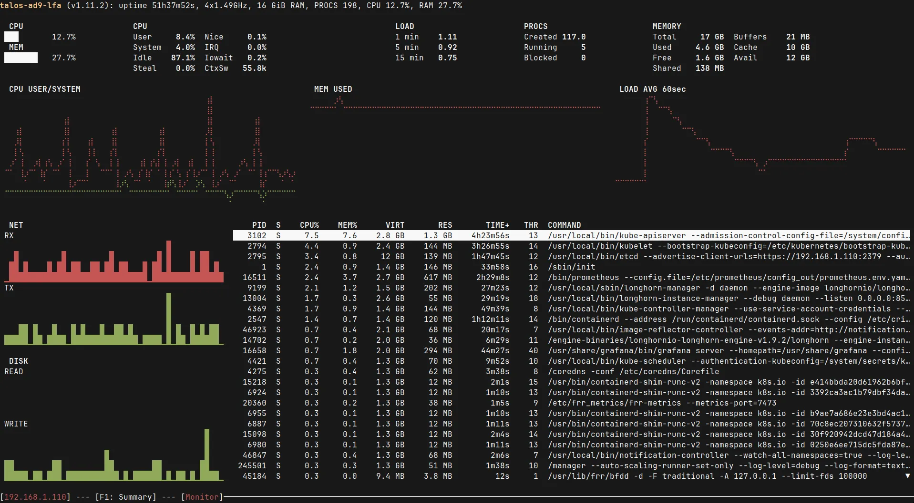
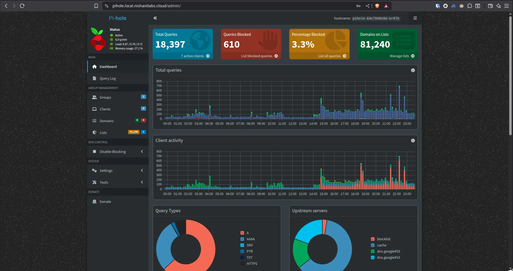
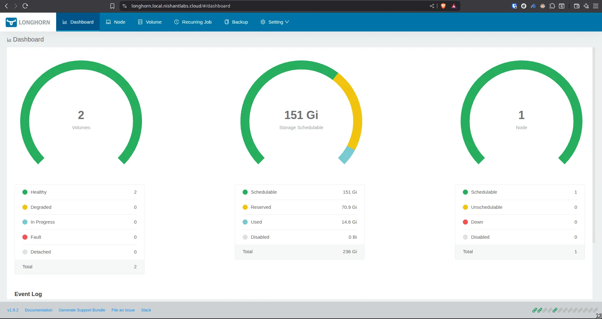
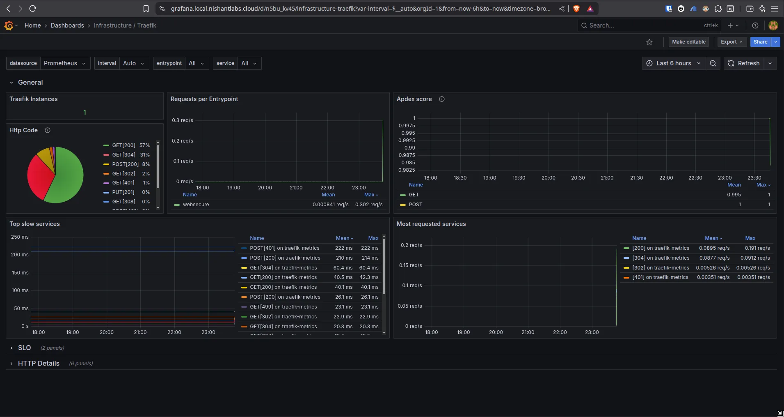
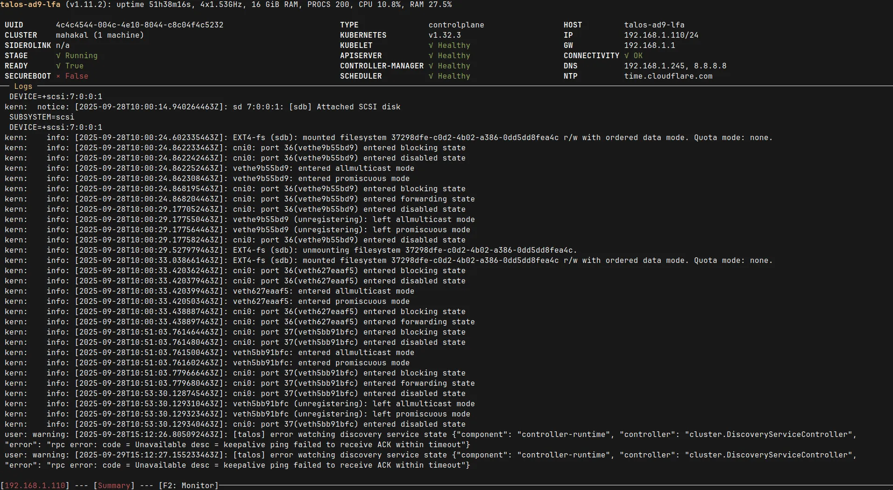

**Github:** [🔗 Link](https://github.com/thakurnishu/homelab)

- End-to-end **Kubernetes platform automation** on bare-metal with **Talos Linux**.
- GitOps-driven deployments with **FluxCD**, managing cluster state declaratively.
- Core stack setup: 
  - **Traefik** (ingress) 
  - **Cert-Manager** (TLS automation) 
  - **MetalLB** (load balancing) 
  - **Longhorn** (distributed storage) 
  - **Prometheus Operator** (monitoring) 
  - **Pihole** (Local DNS Managment).
  - others
- Secure infra with **wildcard SSL**, static IP assignment, and RBAC-driven access.
- Built **Grafana observability dashboards** covering cluster health, ingress, storage, and DNS.
- Designed for **scalability, resilience, and reproducibility** in homelab/edge environments.

Tech: Talos Linux · Kubernetes · FluxCD · Helm · Kustomize · Docker · Traefik · Cert-Manager · MetalLB · Longhorn · Prometheus · Grafana · Bash


  
  
  



  
  

