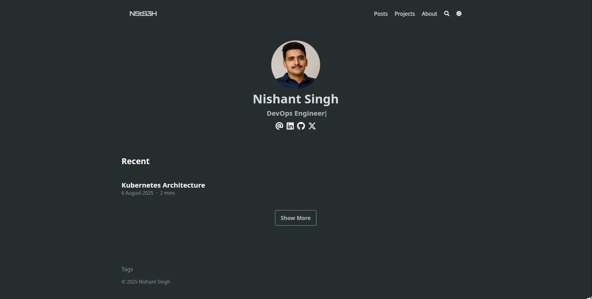
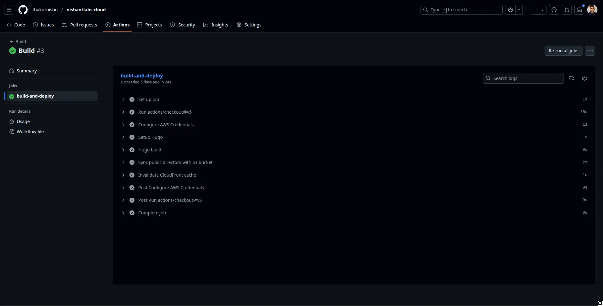
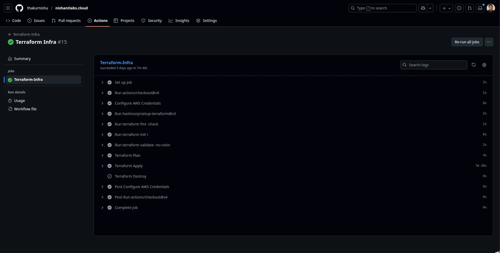
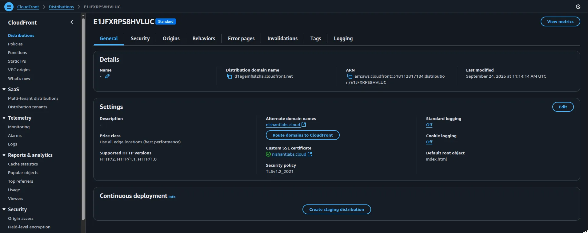
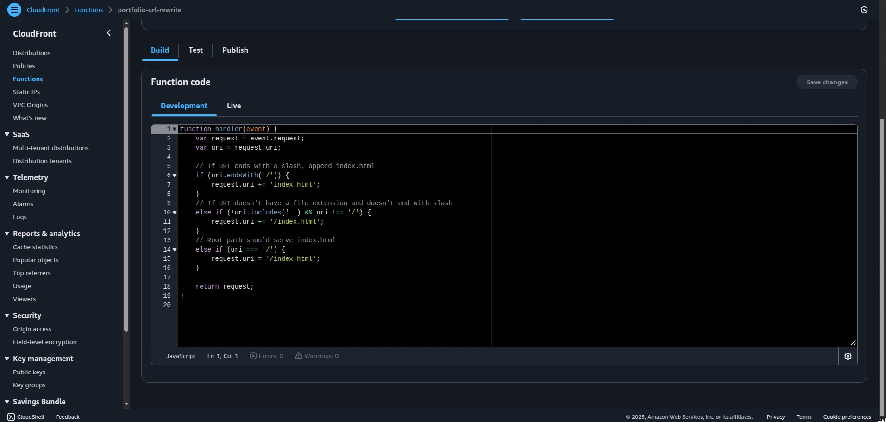

**Website:** [🔗 Link](https://nishantlabs.cloud) | **GitHub:** [🔗 Link](https://github.com/thakurnishu/nishantlabs.cloud)

- **Cloud-native** static portfolio site built with **Hugo & Blowfish** theme.
- **Infrastructure as Code** with **Terraform** to provision **AWS S3 + CloudFront** for global delivery.
- Automated **CI/CD pipeline** using **GitHub Actions** for seamless builds and deployments.
- Highly **optimized, secure, and scalable** static site hosting on **AWS**.

Tech: Hugo · Blowfish · AWS (S3 + CloudFront) · Terraform · GitHub Actions


  
  
  
  
  


