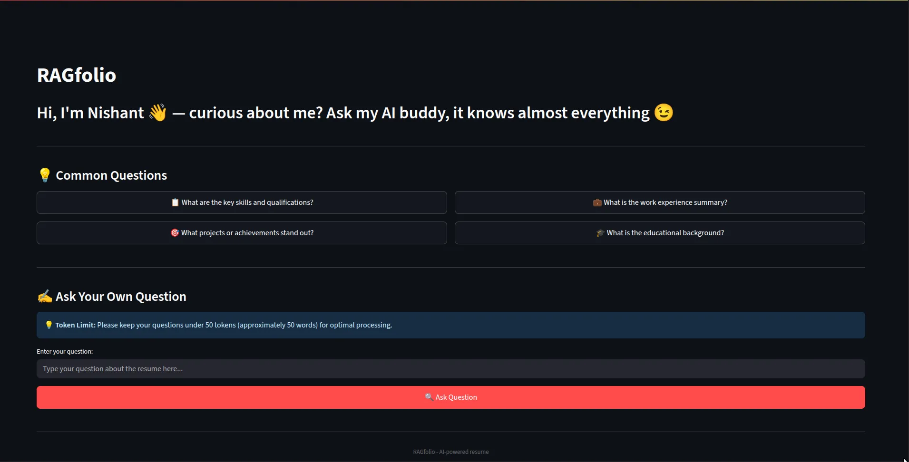
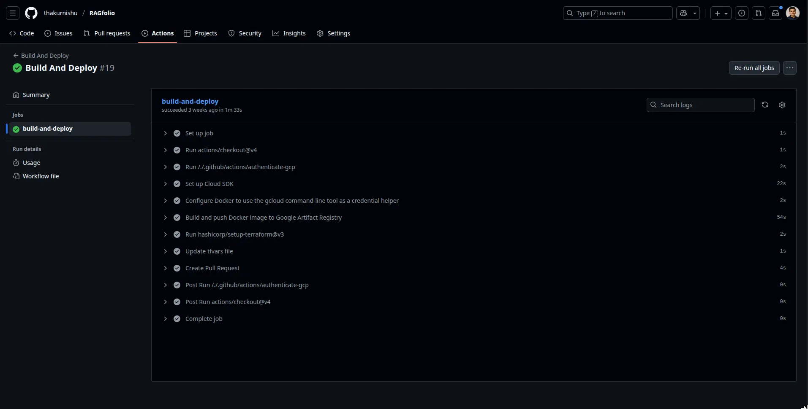
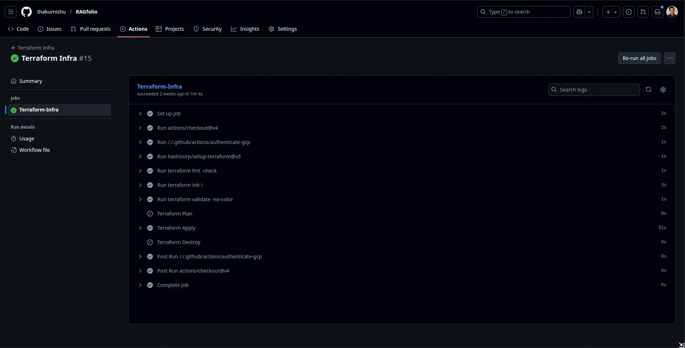
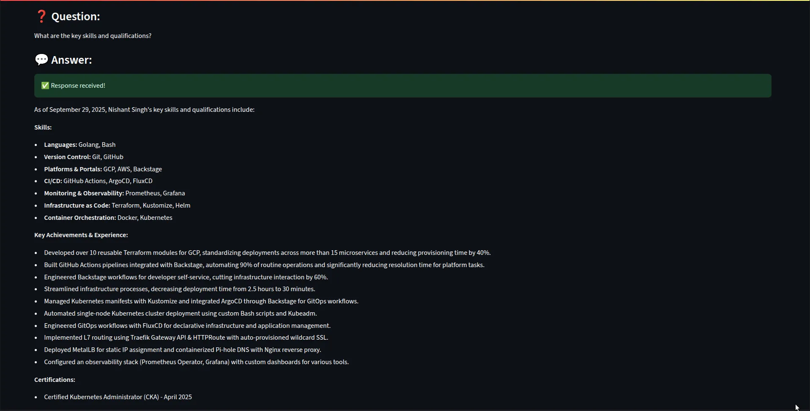
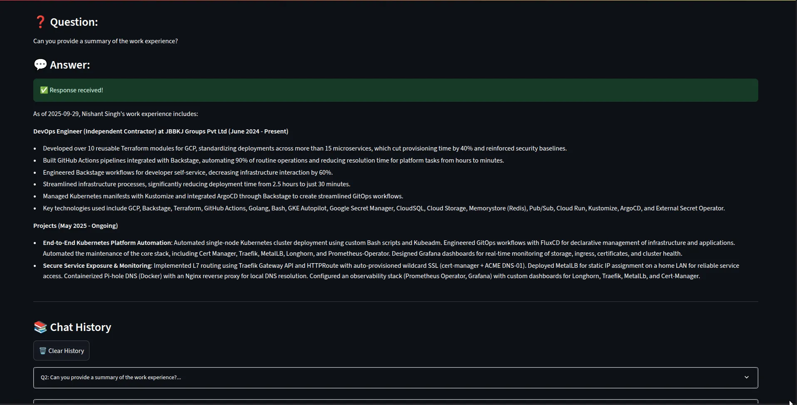

**Website:** [🔗 Link](https://ragfolio.nishantlabs.cloud/)  | **Github**: [🔗 Link](https://github.com/thakurnishu/RAGfolio)
* Cloud-native AI app for portfolio Q&A using **LLMs, LangChain & Chroma**.
* **Streamlit UI** + embeddings pipeline, containerized with **Docker**.
* Deployed on **GCP Cloud Run** with **Terraform** infra.
* Automated CI/CD via **GitHub Actions** with secure secrets.

**Tech:** Streamlit · LangChain · Gemini · ChromaDB · Docker · GCP · Terraform · GitHub Actions


  
  
  
  
  

